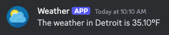

# Weather Discord Bot

The Weather Discord Bot is a simple bot that integrates with a weather API to provide current weather information for specified cities. Users can interact with the bot through commands to retrieve temperature and weather conditions.



---

## Features

- Fetches current weather data for a city.
- Supports multi-word city names (e.g., "Los Angeles").
- Displays temperature in Fahrenheit.

---

## Prerequisites

Before running the bot, ensure you have the following:

- Go 1.19 or later installed on your system.
- A Discord bot token. [Follow this guide to create a bot](https://discord.com/developers/applications).
- An API key for a weather API.
- The weather API endpoint URL (e.g., `http://api.weatherapi.com/v1/current.json?key=<API_KEY>&q=`).

---

## Installation

1. Clone this repository:

   ```bash
   git clone https://github.com/your-username/weather-discord-bot.git
   cd weather-discord-bot
   ```

2. Create a `.env` file in the project root and add the following environment variables:

   ```env
   BOT_TOKEN=your_discord_bot_token
   API_URL=http://api.weatherapi.com/v1/current.json?key=your_api_key&q=
   ```

3. Install dependencies:

   ```bash
   go mod tidy
   ```

4. Build and run the bot:

   ```bash
   go run main.go
   ```

---

## Usage

### Commands

- `!weather <city>`: Fetches the weather for a single-word city. Example: `!weather Tokyo`.
- `!weather <city name>`: Fetches the weather for a multi-word city. Example: `!weather Los Angeles`.

### Example Interactions

**User:** `!weather Tokyo`  
**Bot:** `The weather in Tokyo is 72.54°F`

**User:** `!weather New York`  
**Bot:** `The weather in New York is 68.20°F`

---

## Error Handling

- If the city name is not provided:  
  **Bot:** `Please provide a city name.`

- If the weather data cannot be fetched:  
  **Bot:** `Failed to get weather data for <city>.`

---

## Deployment

To deploy the bot on a cloud platform or containerize it, you can create a Dockerfile:

```dockerfile
# Start from the golang base image
FROM golang:1.22-bullseye as builder

# Set the Current Working Directory inside the container
WORKDIR /app

# Copy go mod and sum files
COPY go.mod go.sum ./

# Download all dependencies. Dependencies will be cached if the go.mod and go.sum files are not changed
RUN go mod download

# Copy the source from the current directory to the Working Directory inside the container
COPY . .

# Build the Go app
RUN CGO_ENABLED=0 GOOS=linux GOARCH=amd64 go build -o /main .

# Start from the distroless image
FROM gcr.io/distroless/static-debian11

# Copy the binary from the builder stage
COPY --from=builder /main /main

# Command to run the executable
CMD ["/main"]
```

Build and run the Docker image:

```bash
docker build -t weather-discord-bot .
docker run -d --env-file .env weather-discord-bot
```

---

## Contributing

Contributions are welcome! Feel free to open issues or submit pull requests to improve this project.

---

## License

This project is licensed under the Do Whatever The Hell You Want With IT (DWTHYWWI) License. See the `LICENSE` file for details.

---

## Acknowledgments

- [DiscordGo](https://github.com/bwmarrin/discordgo) for the Discord library.
- [Weather API](https://www.weatherapi.com/) for weather data.

--- 

Enjoy your weather bot! 🌤️